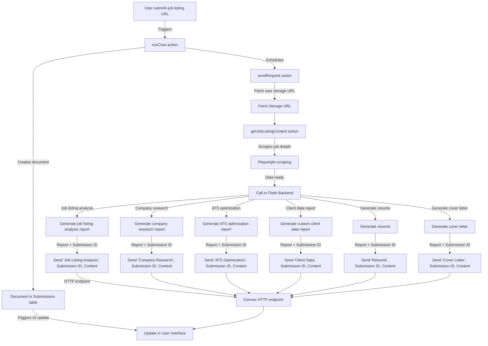

## Simplifying Resume and Cover Letter Creation with Advanced AI and Serverless Architecture

In the dynamic realm of technology, staying updated and integrating emerging technologies are crucial. In my latest project, I've deployed a sophisticated blend of AI orchestration, serverless backend services, and real-time data interactions to automate how job seekers generate personalized resumes and cover letters from job listings. This deep dive into the technical framework and strategic choices behind this web application illustrates the innovative integration of these elements.

## Orchestrating AI with CrewAI

Central to the application is CrewAI, a robust framework designed to manage a series of AI agents, each with a specific role in the job application process. These agents include a job listing analyzer, a company researcher, an ATS (Applicant Tracking System) optimization expert, and dedicated writers for resumes and cover letters. The orchestration of these agents is crucial, as it requires a system that can handle complex dependencies and execute tasks in a precise sequence.

## Implementing CrewAI

1. Setup of AI Agents:
   Each agent is configured with specific scripts tailored to perform its task effectively. For instance, the job listing analyzer is designed to extract key requirements from listings, while the ATS optimization expert adjusts the document based on common ATS parameters.
2. Task Sequencing:
   CrewAI allows for defining dependencies between tasks. For example, the output of the job listing analyzer (key job requirements) informs the company researcher and ATS optimization agent. This ensures that each subsequent task utilizes the latest available data, enhancing the relevance and accuracy of the output.
3. Error Handling and Retry Logic:
   In a multi-agent system, handling failures is crucial. CrewAI is configured to retry tasks if they fail, ensuring that temporary issues (like network failures) do not disrupt the overall workflow.
4. Performance Monitoring:
   CrewAI provides tools to monitor the performance of each agent, allowing for real-time adjustments and optimizations based on observed performance metrics.

## The Role of Scheduling and Queues

Scheduling orchestrates the timing of tasks within the Convex platform, triggering actions at designated times or under specific conditions, ideal for jobs requiring periodic execution or specific triggers.

The application utilizes a queuing system on the Flask backend to manage asynchronous tasks efficiently. This setup ensures tasks are processed in sequence, optimizing resource usage and ensuring timely completion of user requests, especially under high demand.

## Leveraging Convex’s Automatic Reactivity

Convex's standout feature is its automatic reactivity. Any database change (like a new submission) instantly updates the system. This reactivity ensures that the user interface remains current with backend operations, enhancing user experience by displaying real-time updates as documents are processed.

## Conclusion

This application illustrates how automation and AI can address real-world issues effectively, streamlining job application processes by tailoring content to specific job and company details.

## Connect on LinkedIn

I'm eager to connect with other tech enthusiasts and professionals. If you're interested in discussing this project or sharing ideas, please connect with me on LinkedIn at Jack-Casica.

